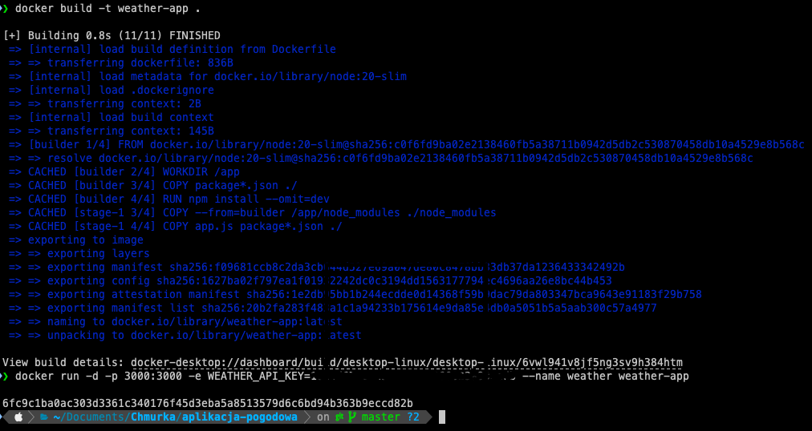
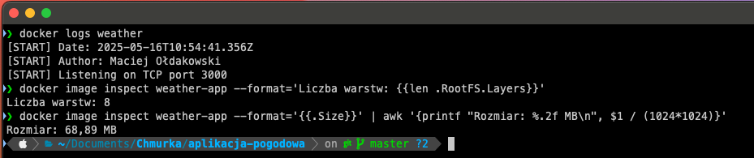

# Autor: Maciej Ołdakowski

# Część obowiązkowa

Aplikacja pogoda napisana korzystając z Node.js i Express. 
API jest pozyskiwne z OpenWeatherMap

```dockerfile

FROM node:20-slim AS builder
LABEL maintainer="Maciej Ołdakowski"
WORKDIR /app

COPY package*.json ./
ENV NODE_ENV=production
RUN npm install --omit=dev

FROM node:20-slim
LABEL org.opencontainers.image.authors="Maciej Ołdakowski"
WORKDIR /app

COPY --from=builder /app/node_modules ./node_modules
COPY app.js package*.json ./

ENV NODE_ENV=production
ENV PORT=3000
EXPOSE 3000

HEALTHCHECK --interval=30s --timeout=10s --start-period=5s --retries=3 \
  CMD curl -f http://localhost:3000 || exit 1

CMD ["node", "app.js"]
```

### 1. Budowanie opracowanego obrazu kontenera i uruchomienie kontenera na podstawie zbudowanego obrazu
```bash
docker build -t weather-app .
```

```bash
docker run -d -p 3000:3000 -e WEATHER_API_KEY=API_KEY --name weather weather-app
```



### 2. Uzyskanie informacji z logów, które wygenerowała aplikacja, sprawdzenie ilości wartsw i rozmiaru obrazu

```bash
docker image inspect weather-app --format='Liczba warstw: {{len .RootFS.Layers}}'
```

```bash
docker image inspect weather-app --format='{{.Size}}' | awk '{printf "Rozmiar: %.2f MB\n", $1 / (1024*1024)}'
```



# Zadanie 2

## Dodano secrety za pomoca komend

`gh secret set DOCKER_USERNAME --body "opekk"`

`gh secret set DOCKER_PASSWORD --body "placeholder"`

## wykonano skan docker_scoutem :

`docker scout cves my-weather-app`

### udało mi się wyrzucić wszystkie criticale, lecz został jeden high (CVE-2023-44487) i nie wiedziałem jak to naprawić

Aby uzyskać taki wynik skanu, musiałem podmienic dockerfile, plik ponizej

```dockerfile
FROM ubuntu:22.04 AS builder
LABEL maintainer="Maciej Ołdakowski"
WORKDIR /app

RUN apt-get update && apt-get install -y curl ca-certificates \
    && rm -rf /var/lib/apt/lists/*

RUN curl -fsSL https://deb.nodesource.com/setup_20.x | bash - \
    && apt-get install -y nodejs \
    && rm -rf /var/lib/apt/lists/*

COPY package*.json ./
ENV NODE_ENV=production
RUN npm install --omit=dev

FROM ubuntu:22.04
LABEL org.opencontainers.image.authors="Maciej Ołdakowski"
WORKDIR /app

RUN apt-get update && apt-get install -y nodejs ca-certificates \
    && rm -rf /var/lib/apt/lists/*

COPY --from=builder /app/node_modules ./node_modules
COPY app.js package*.json ./

ENV NODE_ENV=production
ENV PORT=3000
EXPOSE 3000

HEALTHCHECK --interval=30s --timeout=10s --start-period=5s --retries=3 \
  CMD curl -f http://localhost:3000 || exit 1

CMD ["node", "app.js"]
```

# docker-build.yml - workflows

```dockerfile
name: Build & Scan Docker Image

on:
  push:
    branches: [main]
  pull_request:

jobs:
  build-and-scan:
    runs-on: ubuntu-latest

    permissions:
      contents: read
      packages: write
      security-events: write

    env:
      IMAGE_NAME: ghcr.io/${{ github.repository }}
      TAG: ${{ github.sha }}

    steps:
      - name: Checkout repository
        uses: actions/checkout@v4

      - name: Set up Docker Buildx
        uses: docker/setup-buildx-action@v3

      - name: Log in to GitHub Container Registry
        uses: docker/login-action@v3
        with:
          registry: ghcr.io
          username: ${{ github.actor }}
          password: ${{ secrets.GITHUB_TOKEN }}

      - name: Log in to Docker Hub
        uses: docker/login-action@v3
        with:
          username: ${{ secrets.DOCKER_USERNAME }}
          password: ${{ secrets.DOCKER_PASSWORD }}

      - name: Build Docker image (and load locally for scan)
        uses: docker/build-push-action@v5
        with:
          context: .
          load: true
          tags: ${{ env.IMAGE_NAME }}:latest
          file: Dockerfile

      - name: Scan image with Docker Scout
        uses: docker/scout-action@v1
        with:
          command: cves
          image: ${{ env.IMAGE_NAME }}:latest
          only-severities: critical
          fail-on: critical
```


